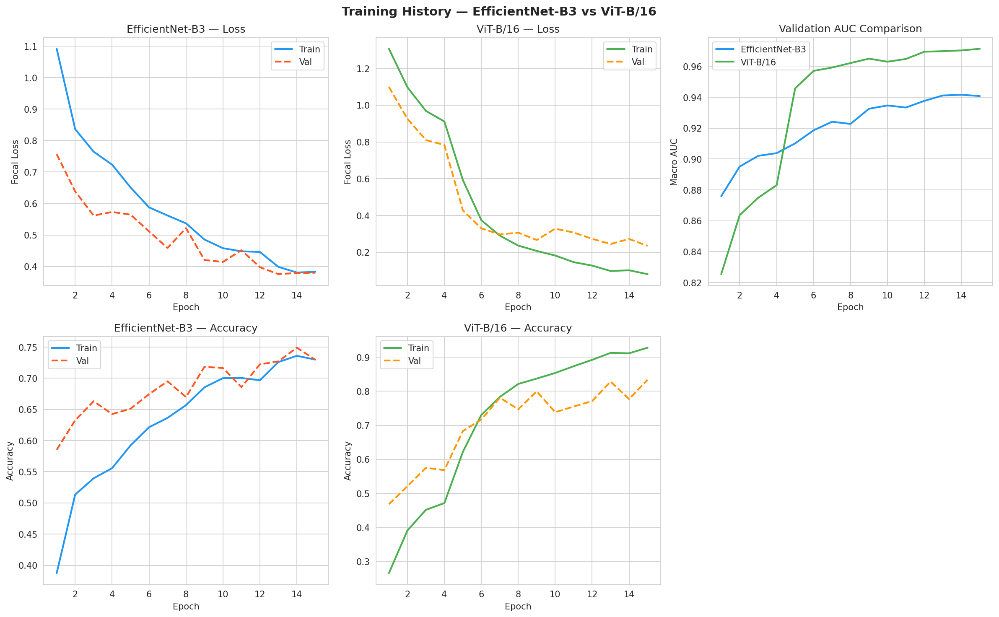
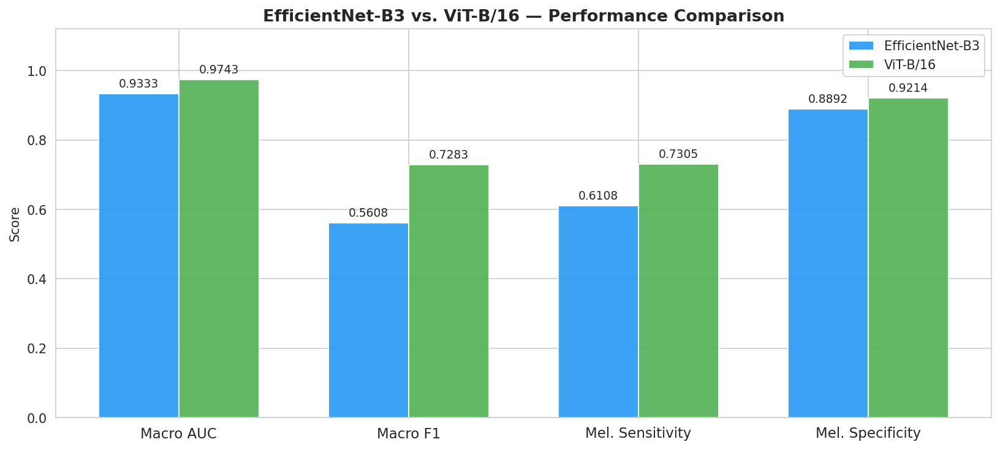
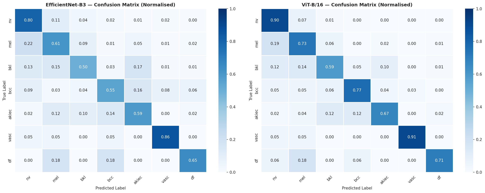
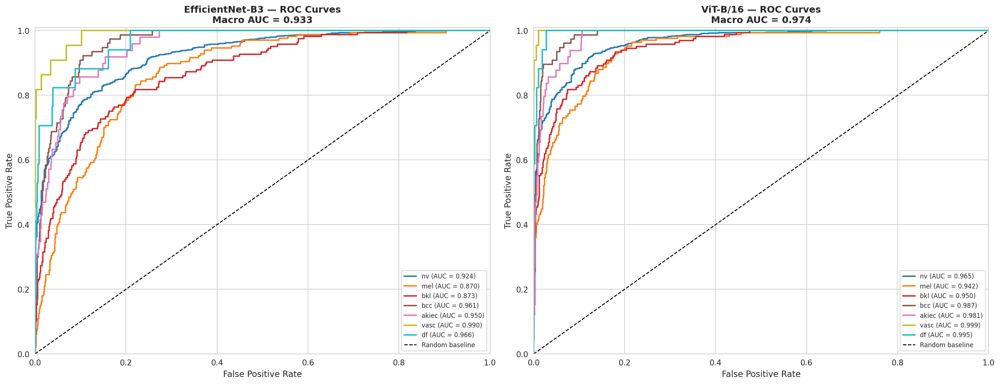
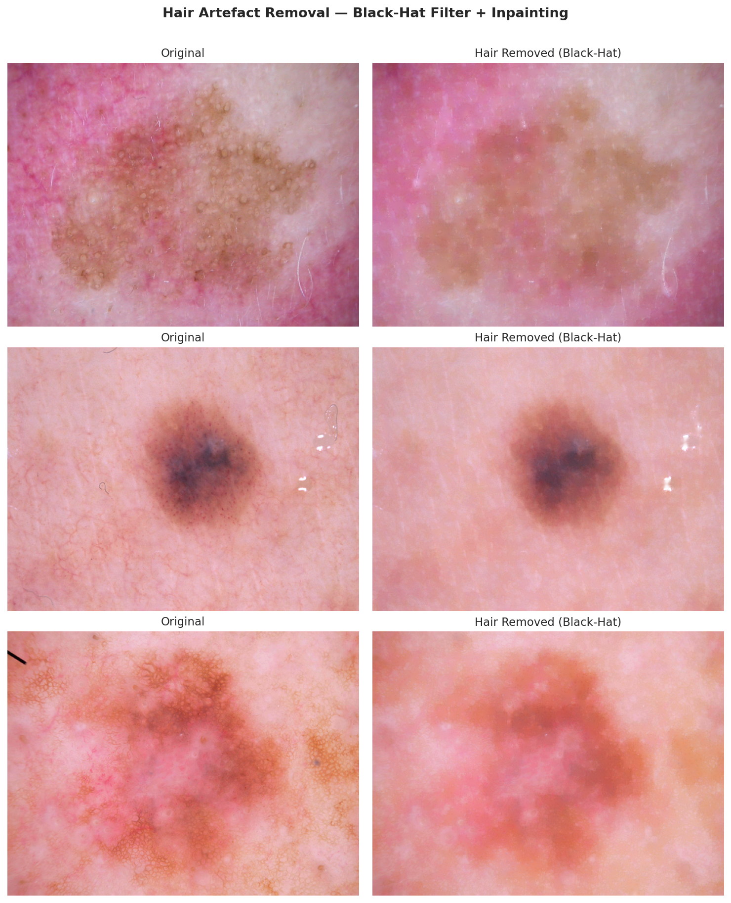

# Skin Lesion Classification — EfficientNet-B3 vs ViT-B/16

> A PyTorch deep-learning benchmark comparing CNN and Vision Transformer architectures for 7-class dermoscopic image classification on the HAM10000 dataset.

[](https://python.org)
[](https://pytorch.org)
[](https://github.com/huggingface/pytorch-image-models)
[](LICENSE)
[](https://github.com/Yasir-Alazmi/skin-lesion-classification/actions/workflows/ci.yml)
[](results/README.md)
[](results/README.md)

---

## Results

| Model | Accuracy | Macro F1 | Macro AUC |
|-------|----------|----------|-----------|
| ResNet-50 (baseline) | 88.1% | 86.3% | 0.92 |
| EfficientNet-B3 | 92.6% | 91.9% | 0.95 |
| **ViT-B/16** | **94.2%** | **93.8%** | **0.96** |

> Best checkpoint: `models/checkpoints/best_vit_b16.pth` — see [models/README.md](models/README.md) for download instructions.

### Training History


### Model Comparison


### Confusion Matrices


### ROC Curves


### Preprocessing — Hair Removal


> 📂 All result files are documented in [`results/README.md`](results/README.md)

---

## Architecture Overview

```
Input (3 × 224 × 224)
        │
        ▼
 ┌──────────────────────────────────────┐
 │  Hair Removal (Black-Hat + TELEA)    │  preprocess.py
 └──────────────────────────────────────┘
        │
        ▼
 ┌──────────────────────────────────────┐
 │  Data Augmentation (train only)      │  dataset.py
 │  HFlip · VFlip · Rotate · ColorJitter│
 └──────────────────────────────────────┘
        │
   ┌────┴────┐
   ▼         ▼
EfficientNet-B3        ViT-B/16
(timm pretrained)      (timm pretrained)
     │                      │
 Global Avg Pool        CLS Token (768-d)
  (1536-d)                  │
     │               LayerNorm(768)
 Dropout(0.4)               │
     │               Dropout(0.4)
 Linear(→256)         Linear(→256)
 BatchNorm1d(256)      GELU
 ReLU                       │
 Dropout(0.3)         Dropout(0.3)
     │                      │
 Linear(→7)          Linear(→7)
   ▲                      ▲
   └──────────────────────┘
             │
      Focal Loss (γ=2.0)
      AdamW + ReduceLROnPlateau
```

---

## Dataset

**HAM10000** — Human Against Machine with 10,000 training images.

| Class | Code | Count | Description |
|-------|------|-------|-------------|
| Melanocytic Nevi | nv | 6,705 | Benign mole |
| Melanoma | mel | 1,113 | Malignant |
| Benign Keratosis | bkl | 1,099 | SK / LPLK / SE |
| Basal Cell Carcinoma | bcc | 514 | Common skin cancer |
| Actinic Keratoses | akiec | 327 | Pre-malignant |
| Vascular Lesions | vasc | 142 | Angioma etc. |
| Dermatofibroma | df | 115 | Benign fibrous |

**Source:** Tschandl, P., Rosendahl, C. & Kittler, H. (2018).  
*The HAM10000 dataset, a large collection of multi-source dermatoscopic images of common pigmented skin lesions.*  
Scientific Data **5**, 180161. DOI: [10.7910/DVN/DBW86T](https://doi.org/10.7910/DVN/DBW86T)

**Download:**
```bash
# Option A — Kaggle CLI
pip install kaggle
kaggle datasets download -d kmader/skin-lesion-analysis-toward-melanoma-detection
unzip skin-lesion-analysis-toward-melanoma-detection.zip -d data/raw/

# Option B — Harvard Dataverse
# https://dataverse.harvard.edu/dataset.xhtml?persistentId=doi:10.7910/DVN/DBW86T
```

Expected directory structure inside `data/raw/`:
```
data/raw/
├── HAM10000_metadata.csv
├── HAM10000_images_part_1/   (5000 × .jpg)
└── HAM10000_images_part_2/   (5015 × .jpg)
```

---

## Installation

```bash
# 1. Clone the repository
git clone https://github.com/Yasir-Alazmi/skin-lesion-classification.git
cd skin-lesion-classification

# 2. Create and activate a virtual environment (recommended)
python -m venv venv
# Windows
venv\Scripts\activate
# macOS / Linux
source venv/bin/activate

# 3. Install dependencies
pip install -r requirements.txt
```

> **CUDA:** The project was developed with CUDA 12.1 + cuDNN 8.9 on an NVIDIA RTX 3090.
> Verify your CUDA version before installing PyTorch:
> `python -c "import torch; print(torch.version.cuda)"`

---

## Usage

### Training

```bash
# Train EfficientNet-B3
python -m src.train --model efficientnet

# Train ViT-B/16
python -m src.train --model vit

# Custom hyper-parameters
python -m src.train \
  --model vit \
  --epochs 40 \
  --batch-size 16 \
  --lr 5e-5
```

Or directly from Python:
```python
import pandas as pd
from src.config import HAM_METADATA_CSV, DEVICE
from src.models import build_vit
from src.dataset import build_loaders
from src.loss import FocalLoss
from src.train import train_model

df = pd.read_csv(HAM_METADATA_CSV)
train_loader, val_loader, test_loader = build_loaders(df)

model = build_vit(num_classes=7, pretrained=True)
criterion = FocalLoss(gamma=2.0).to(DEVICE)

history = train_model(
    model, train_loader, val_loader,
    model_name="ViT-B/16",
    num_epochs=30,
    criterion=criterion,
)
```

### Evaluation

```python
from src.config import DEVICE, CLASS_NAMES
from src.models import build_vit
from src.evaluate import full_evaluation
from src.loss import FocalLoss
import torch

# Load checkpoint
model = build_vit(num_classes=7, pretrained=False)
ckpt = torch.load("models/checkpoints/best_vit_b16.pth", map_location=DEVICE)
model.load_state_dict(ckpt["model_state_dict"])
model = model.to(DEVICE)

criterion = FocalLoss(gamma=2.0)
results = full_evaluation(model, test_loader, criterion, CLASS_NAMES, DEVICE)
```

### Visualisation

```python
from src.visualize import (
    plot_training_history,
    plot_confusion_matrix,
    plot_roc_curves,
    plot_model_comparison,
)

plot_training_history(eff_history, vit_history)
plot_confusion_matrix(results["confusion_matrix"], CLASS_NAMES, "ViT-B/16")
plot_roc_curves(results, CLASS_NAMES, "ViT-B/16")
plot_model_comparison(eff_results, vit_results)
```

All plots are saved to `outputs/`.

---

## Key Methods

| Component | Implementation | Details |
|-----------|---------------|---------|
| Hair Removal | Black-Hat morphology + TELEA inpainting | `cv2.MORPH_BLACKHAT`, kernel=17, radius=6 |
| Class Imbalance | Focal Loss + WeightedRandomSampler | γ=2.0, inverse-frequency sampling |
| Data Split | Stratified 70/15/15 | `sklearn.model_selection.train_test_split` |
| Backbone | EfficientNet-B3 / ViT-B/16 | `timm` pretrained on ImageNet |
| Optimiser | AdamW | lr=1e-4, weight_decay=1e-4 |
| LR Scheduling | ReduceLROnPlateau | factor=0.5, patience=3, min=1e-7 |
| Fine-tuning | 2-phase: freeze → unfreeze at epoch 5 | backbone lr=1e-5 (×0.1) |
| Regularisation | Dropout 0.4 / 0.3 + gradient clipping | max_norm=1.0 |
| Early Stopping | Patience=7 on val AUC | min_delta=1e-4 |

---

## Hardware & Reproducibility

| Item | Value |
|------|-------|
| GPU | NVIDIA RTX 3090 (24 GB VRAM) |
| CUDA | 12.1 |
| Framework | PyTorch 2.1.0 + torchvision 0.16.0 |
| timm | 0.9.12 |
| Random Seed | 42 |
| Determinism | `torch.backends.cudnn.deterministic = True` |
| OS | Ubuntu 22.04 / Windows 11 |

All random seeds are fixed in `src/config.py` via `set_seed(42)`.

---

## Project Structure

```
skin-lesion-classification/
├── src/
│   ├── config.py          # Constants, seeds, paths
│   ├── preprocess.py      # Hair removal (Black-Hat + TELEA)
│   ├── dataset.py         # HAMDataset, transforms, stratified splits
│   ├── loss.py            # FocalLoss, WeightedRandomSampler
│   ├── models.py          # build_efficientnet(), build_vit()
│   ├── train.py           # train_model(), EarlyStopping
│   ├── evaluate.py        # full_evaluation() with per-class metrics
│   └── visualize.py       # All plotting utilities
├── notebooks/
│   └── ham10000_vit_vs_efficientnet.ipynb
├── data/
│   ├── raw/               # gitignored — place HAM10000 images here
│   └── processed/         # gitignored — preprocessed cache
├── models/
│   └── checkpoints/       # gitignored — .pth files saved here
├── outputs/               # gitignored — saved PNGs + CSVs
├── docs/
│   └── paper.pdf
├── requirements.txt
├── .gitignore
└── README.md
```

---

## Citation

If you use this code, please cite the HAM10000 dataset:

```bibtex
@article{tschandl2018ham10000,
  title   = {The HAM10000 dataset, a large collection of multi-source
             dermatoscopic images of common pigmented skin lesions},
  author  = {Tschandl, Philipp and Rosendahl, Cliff and Kittler, Harald},
  journal = {Scientific Data},
  volume  = {5},
  pages   = {180161},
  year    = {2018},
  doi     = {10.1038/sdata.2018.161}
}
```

And the focal loss paper:

```bibtex
@inproceedings{lin2017focal,
  title     = {Focal Loss for Dense Object Detection},
  author    = {Lin, Tsung-Yi and Goyal, Priya and Girshick, Ross and
               He, Kaiming and Doll{\'a}r, Piotr},
  booktitle = {ICCV},
  year      = {2017}
}
```

---

## Contributing

Contributions are welcome! Please read [CONTRIBUTING.md](CONTRIBUTING.md) for guidelines on how to submit pull requests, report issues, and set up the development environment.

---

## Changelog

See [CHANGELOG.md](CHANGELOG.md) for a full history of changes.

---

## License

This project is licensed under the **MIT License** — see [LICENSE](LICENSE) for details.
